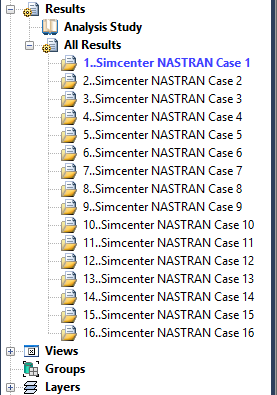
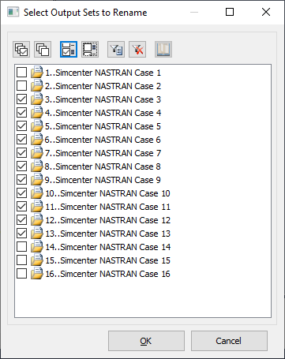
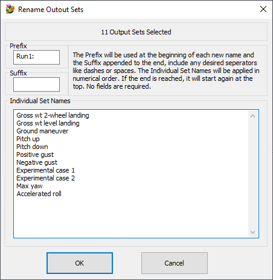
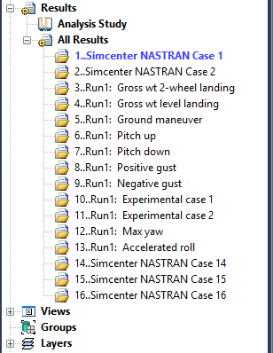

# Femap-Batch-Rename-Outputs
Easily rename multiple output sets at once

See also: [How to use Femap Scripts](https://github.com/aaronjasso/How_to_use_Femap_Scripts) and [The List of my Femap Scripts](https://github.com/aaronjasso/My-Femap-Scripts)

---

The auto-generated output names are not very useful, but renaming individual output sets is tedious.

This program quickly and easily renames any number of output sets based on user input. First, the user is prompted to select the output sets to rename:

The next dialog has input options for new new names. The in-dialog text explains the behavior in further detail.

Click OK and the selected outputs are almost instantly renamed to something more useful.

